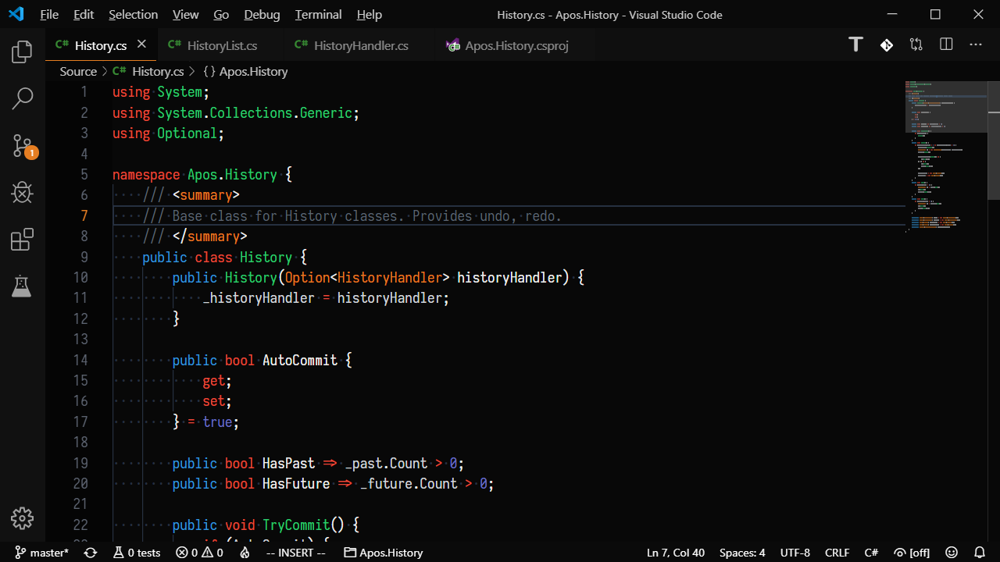
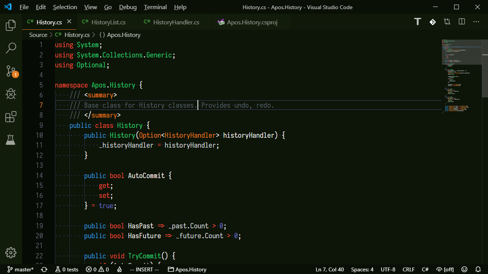
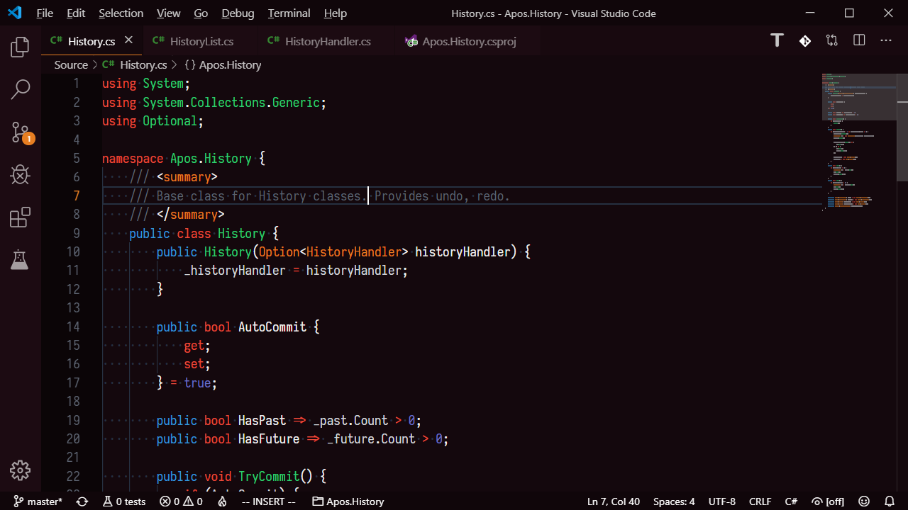

# AposTheme
Apos' Theme for VSCode. Based on Brogrammer and Sapphire.

## Install
Get it from the [Visual Studio Marketplace](https://marketplace.visualstudio.com/items?itemName=vyne.apostheme) or search for `AposTheme` in the vscode extensions search.

## Preview

## Colors
-  `#05070b`
-  `#080d14`
-  `#E74C3C`
-  `#E67E22`
-  `#F1C40F`
-  `#6C71C4`
-  `#3498DB`
-  `#2ECC71`
-  `#5C6370`
-  `#D2D6DB`

## Derivatives

